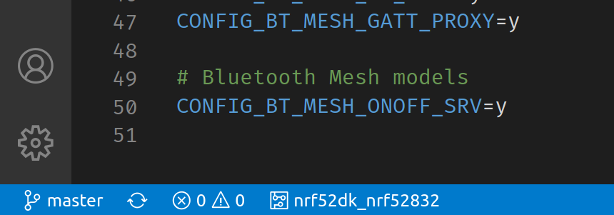

# Kconfig for the Zephyr Project

Kconfig language support for the [Zephyr Project](https://www.zephyrproject.org/) in VS Code.

This extension is an independent community contribution, and is not part of the Zephyr Project.

## Features

This extension adds features for Kconfig, properties (.conf) and C files.

### Kconfig features

Adds support for the Kconfig language:
- Syntax highlighting
- Autocompletion
- Hover information
- Workspace symbols
- Go to definition
- Follow `source` links
- Resolves environment replacements
- [Breadcrumbs](https://code.visualstudio.com/docs/editor/editingevolved#_breadcrumbs) navigation
- Find all references
- Diagnostics

### Properties file features

Out of the box, VS Code has syntax highlighting for properties files.

This extension adds contextual information for the properties files:
- Autocompletion based on Kconfig files
- Hover information
- Go to definition
- Syntax checking
- Linting:
  - Typechecking configuration values
  - Range checking
  - Checking for redundant entries
  - Checking for invalid combinations
  - Dependency checking
  - Warning about entries without prompts
- [Code Actions](https://code.visualstudio.com/docs/editor/editingevolved#_code-action)
  - Add missing dependencies
  - Remove redundant entries
  - Use selector entry when trying to set entries without prompts

### C file features

The extension adds symbol information for `CONFIG_` defines in C files.
Hover info and go to definition is provided for all defines starting with `CONFIG_`.

This feature can be turned off with the kconfig.cfiles configuration entry.

## Installation

The extension can be installed from the Visual Studio Extension marketplace.

It's also possible to download specific releases from the GitHub repository by picking a kconfig-lang-X.X.X.vsix package from the GitHub releases tab. Open Visual Studio Code and run the "Install from VSIX..." command, either through the command palette (Ctrl+Shift+P) or by opening the extensions panel, and pressing the ... menu in the top corner. Locate the VSIX package, press "Install" and reload Visual Studio Code once prompted.

## Configuration

The Kconfig extension's environment and parameters are fully configurable. See the extension's Configuration tab for details.

## Zephyr setup

Assuming that the Zephyr Project environment is set up
[with West](https://docs.zephyrproject.org/latest/getting_started/index.html#get-the-source-code),
the extension will just work without any configuration needed.

> Note: The extension requires West version 0.7.0 and newer to work out of the box. For older versions of West, the Zephyr base directory has to be configured manually.

The entire Kconfig tree (including external modules) is parsed on startup,
and all features will be available as soon as the parsing is complete. This typically takes only 1-2 seconds
after the extension has been activated, and if everything went smoothly, a report will pop up in the
status bar at the bottom of the screen detailing the number of entries found (should be in the range of
5000-10000 depending on configuration and module set) as well as the time spent parsing.

The Zephyr Project modules (external projects used by Zephyr) are retrieved
with West, in accordance with the [module.yml file specification](https://docs.zephyrproject.org/latest/guides/modules.html#module-inclusion).

The active board is displayed on the left side of the status bar when editing properties files (prj.conf and similar):

To change boards, press the board name on the status bar, or run the "Kconfig: Set board for Zephyr"
command from the command palette (Ctrl+Shift+P). This brings up a quick select menu populated by `west boards`.
The board selection has no effect on the Kconfig file parsing, it only comes into effect when working in properties files.

The Zephyr configuration can be completely overridden through the extension configuration menu.

> Note: DeviceTree choice macros, like `$(dt_chosen_reg_addr_hex,$(DT_CHOSEN_Z_CODE_PARTITION))` are not supported, and their configuration values will not be evaluated.
