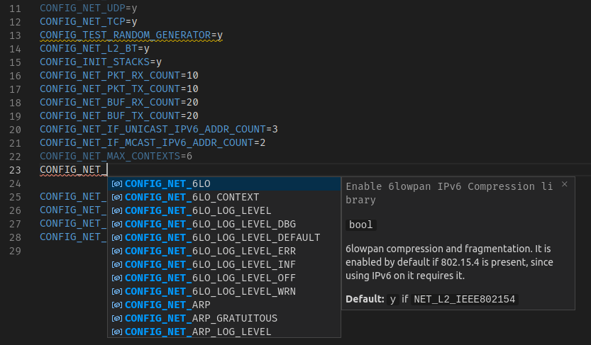

Kconfig language support in vscode.

Made specifically for the
[Zephyr project RTOS](https://www.zephyrproject.org/) to aid application development.

# Features

This extension adds features for two filetypes: Kconfig and configuration (.conf) files.

## Kconfig features


Adds support for the Kconfig language:
- Syntax highlighting
- Autocompletion
- Hover information
- Workspace symbols
- Go to definition
- Follow `source` links
- Resolves environment replacements
- [Breadcrumbs](https://code.visualstudio.com/docs/editor/editingevolved#_breadcrumbs) navigation
- Find `select` symbols

## Configuration file features



Out of the box, VS Code has syntax highlighting for configuration files.

This extension adds contextual information for the configuration files:
- Autocompletion based on Kconfig files
- Hover information
- Go to definition
- Syntax checking
- Linting:
  - Typechecking configuration values
  - Range checking
  - Checking for redundant entries
  - Checking for invalid combinations
  - Dependency checking
  - Warning about entries without prompts
- [Code Actions](https://code.visualstudio.com/docs/editor/editingevolved#_code-action)
  - Add missing dependencies
  - Remove redundant entries
  - Use selector entry when trying to set entries without prompts

# Configuration

Adds five configuration entries:

## kconfig.root

Root of the project's Kconfig files. Will be parsed upon activation.

Default: `./Kconfig`

## kconfig.recursive

Follow `source`, `rsource` and `osource` links in the Kconfig files when parsing.

Default: `true`

## kconfig.env

Environment for inline replacements in the Kconfig files. Each entry will be replaced
in the Kconfig files when encountered as `${entry_name}`. Will also do replacements in
variables in the Kconfig configuration. For instance, an environmental variable may
contain others, like:

```json
"ARCH": "arm",
"BOARD": "nrf52_pca10040",
"BOARD_DIR": "boards/${ARCH}/${BOARD}"
```

Here, `BOARD_DIR` will resolve to `boards/arm/nrf52_pca10040`. The environmental variables
also support VS Code workspace directory replacements: `${workspaceFolder}` and
`${workspaceFolder:zephyr}`, as described in
[the VS Code documentation](https://code.visualstudio.com/docs/editor/variables-reference#_predefined-variables).
Note that other predefined variables from the documentation are not supported.

Default: None

## kconfig.conf

Static configuration entries that are always defined before parsing configuration files.
Should be on the form `"CONFIG_ENTRY_NAME": "y"`. No typechecking or linting is performed
on these variables, but if they're duplicated in the parsed configuration file, a warning
will be produced.

Default: None

## kconfig.conf_files

Like `kconfig.conf`, this entry allows you to add static configuration items, but instead
of defining singular entries, this lists configuration files. The file name may use
environmental completion based on `kconfig.env` and the workspace folder variables, see
[kconfig.env](#kconfig.env).

No typechecking or linting is performed on the variables in these files, but if they're
duplicated in the parsed configuration file, a warning will be produced.

# Zephyr setup

Zephyr has several environment variables defined:
- `ARCH`: CPU architecture, e.g. `arm` or `x86`.
- `BOARD`: Board being used, e.g. `nrf52_pca10040` or `native_posix`.
- `ARCH_DIR`: The architecture directory, `arch`
- `BOARD_DIR`: The board directory for the selected board, normally `${workspaceFolder:zephyr}/boards/${ARCH}/${BOARD}`

It also always includes the board defconfig file in the parsing: `${workspaceFolder:zephyr}/${BOARD_DIR}/${BOARD}_defconfig`
